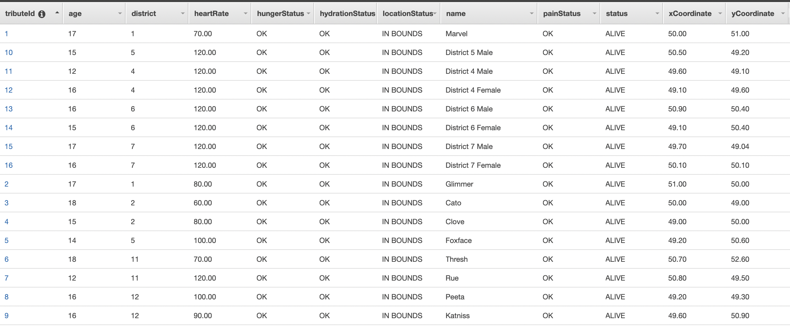

# Real Time Analytics For Hunger Games Tributes Using AWS Glue Streaming ETL

## Idea:
Imagine that you're a Hunger Games sponsor - wouldn't you want to constantly know the most up-to-date status of your favorite tribute? 

Or imagine that you're a Gamemaker - wouldn't you want to know the most up-to-date statuses of all the tributes?

In the movies, a tracker was injected into each tribute before the start of the games. Suppose that in addition to tracking whereabouts,
this device also tracks data on hydration, hunger, and pain levels and that all this data gets sent off to a Kinesis stream.

Using Glue Streaming ETL, we can read data off this kinesis stream, combine it with external data in DynamoDB and S3,
perform analysis, and output the most up-to-date tribute statuses to a constantly changing DynamoDB table.

## Architecture Diagram


## The Data

### Tribute Streaming Event:
The data the tracker picks up and sends to the kinesis stream.

Example event:
```json
{
    "streamingeventid": "eventId",
    "gameid": "gameId1",
    "tributeid": "1",
    "heartrate": 140,
    "painlevel": 0,
    "hydrationlevel": 10,
    "hungerlevel": 0,
    "xcoordinate": 50.5,
    "ycoordinate": 76.3
  }
```
`streamingeventid`: The unique id of the event.

`gameid`: The id of the particular Hunger Games. Used to grab additional game data from DynamoDB.

`tributeid`: The id of the tribute the data refers to. Used to get additional tribute data from S3.

`heartrate`: The heart rate of the tribute. Used to determine if the tribute is still alive or not.

`painlevel`: The pain level of the tribute on a 0 (no pain) - 10 (a lot of pain) scale. Compared against tribute data from S3 to determine the tribute's pain status.

`hydrationlevel`: The hydration level of the tribute on a 0 (very dehydrated) - 10 (very hydrated) scale. Compared against tribute data from S3 to determine the tribute's hydration status.

`hungerlevel`: The hunger level of the tribute on a 0 (not hungry) - 10 (very hungry) scale. Compared against tribute data from S3 to determine the tribute's hunger status.

`xcoordinate/ycoordinate`: The location of the tribute. Compared against game boundary data from DynamoDB to determine the tribute's location status (IN BOUNDS, APPROACHING THE BOUNDARY, OUT OF BOUNDS).

### Tribute Data
This is a dataset that is sitting in S3 and contains base information on each of the tributes.
The file can be found locally at `/staticData/s3/staticTributeData.csv`. For the threshold values, assume that there was extensive
testing on each tribute that determines what values of hunger, hydration and pain lead to reduced performance in the arena. These threshold values
then get used when streaming data comes along to analyze the hunger, hydration and pain statuses for the tributes and update the output DynamoDB table.

| tributeId | district | firstName         | age | gender | minHydrationThreshold | maxHungerThreshold | maxPainThreshold |
|-----------|----------|-------------------|-----|--------|-----------------------|--------------------|------------------|
| 1         | 1        | Marvel            | 17  | M      | 6.0                   | 6.5                | 7.0              |
| 2         | 1        | Glimmer           | 17  | F      | 5.0                   | 4.0                | 7.0              |
| 3         | 2        | Cato              | 18  | M      | 5.5                   | 6.0                | 8.5              |
| 4         | 2        | Clove             | 15  | F      | 5.0                   | 5.0                | 7.5              |
| 5         | 5        | Foxface           | 14  | F      | 4.0                   | 6.0                | 3.0              |
| 6         | 11       | Thresh            | 18  | M      | 8.0                   | 8.0                | 9.0              |
| 7         | 11       | Rue               | 12  | F      | 3.0                   | 3.0                | 5.0              |
| 8         | 12       | Peeta             | 16  | M      | 4.0                   | 5.0                | 6.0              |
| 9         | 12       | Katniss           | 16  | F      | 7.0                   | 7.0                | 7.0              |
| 10        | 5        | District 5 Male   | 15  | M      | 5.0                   | 5.0                | 5.0              |
| 11        | 4        | District 4 Male   | 12  | M      | 5.0                   | 5.0                | 5.0              |
| 12        | 4        | District 4 Female | 16  | F      | 5.0                   | 5.0                | 5.0              |
| 13        | 6        | District 6 Male   | 16  | M      | 5.0                   | 5.0                | 5.0              |
| 14        | 6        | District 6 Female | 15  | F      | 5.0                   | 5.0                | 5.0              |
| 15        | 7        | District 7 Male   | 17  | M      | 5.0                   | 5.0                | 5.0              |
| 16        | 7        | District 7 Female | 16  | F      | 5.0                   | 5.0                | 5.0              |

`tributeId`: The id of the tribute. Joins with the `tributeid` from the streaming events.

`district`: The district the tribute comes from.

`firstName`: Tribute name.

`age`: Tribute age.

`gender`: Tribute gender.

`minHydrationThreshold`: The hydration level where the tribute becomes dehydrated and their performance in the arena suffers. Compared against the `hydrationlevel` from the streaming events to determine hydration status.

`maxHungerThreshold`: The hunger level where the tribute becomes hungry enough that their performance in the arena suffers. Compared against `hungerlevel` from the streaming events to determine hunger status.

`maxPainThreshold`: The pain level where the tribute's injuries hinder performance in the arena. Compared against `painlevel` from the streaming events to determine pain status.

### Game Data
In a DynamoDB table, there is an item that specifies the boundary of the Hunger Games. The values can be found at: `staticData/dynamo/gameData.json`
```json
{
  "gameid": "gameId1",
  "maxXCoordinate": 100,
  "maxYCoordinate": 100,
  "minXCoordinate": 0,
  "minYCoordinate": 0
}
```
`gameId`: The id of the game. Joins with the `gameid` from the streaming events.

`maxXCoordinate/maxYCoordinate/minXCoordinate/minYCoordinate`: Determines the boundary of the game and if someone tries to go beyond the boundary, they will need to turn around.
Compared against the `xCoordinate/yCoordinate` from the streaming events to determine locations status.

## The Output DynamoDB Table
This table will constantly be receiving updates and being written to by the glue job. When events are sent to kinesis, the job will process the events and will write any updates to the DynamoDB output table.
This table will always contain the most up to date information for all the tributes.

The following is a screenshot with some test data from the middle of a typical Hunger Games:


`tributeId`: The id of the tribute - originated from a streaming event.

`age`: Age of the tribute - originated from tribute data in S3.

`district`: The district the tribute comes from - originated from tribute data in S3.

`heartRate`: The tribute's heart rate - originated from a streaming event.

`hungerStatus`: The tribute's hunger status. Using the `hungerlevel` value on streaming events and the `maxHungerThreshold` from the tribute data in S3, the job compares these value and produces an output of OK or HUNGRY.

`hydrationStatus`: The tribute's hydration status. Using the `hydrationlevel` value on streaming events and the `minHydrationThreshold` from the tribute data in S3, the job compares these value and produces an output of OK, APPROACHING DEHYDRATION, or DEHYDRATED.

`locationStatus`: The tribute's location status. Using the `xCoordinate` and `yCoordinate` value on the streaming events and the `maxXCoordinate/maxYCoordinate/minXCoordinate/minYCoordinate` in the game details DynamoDB table, the job compares these values and produces and output of IN BOUNDS, APPROACHING THE BOUNDARY, or OUT OF BOUNDS

`name`: First name of the tribute - originated from tribute data in S3.

`painStatus`: The tribute's pain status. Using the `painlevel` value on streaming events and the `maxPainThreshold` from the tribute data in S3, the job compares these value and produces an output of OK or INJURED.

`status`: Whether the tribute is alive or not. Using the `heartrate` value on streaming events, the job will output whether the tribute is ALIVE or DEAD.

`xCoordinate/yCoordinate`: The coordinates of the tribute - originated from a streaming event.

## The Events That Are Being Sent Through
All the events that are being sent through can be found in `streamingData/`.
I crafted the events to send through in an order that when watching the output DynamoDB table it would somewhat resemble the 74th Annual Hunger Games.
So, in order of being sent through, here is the gist of what is happening in the different event groupings and screenshots from the output DynamoDB table after sending the events through:

`preCornucopia.json`: The trackers were just inserted, and the games are about to start. Heart rates are high for most, career district tributes are calmer, everyone is alive.


<hr>

`postCornucopia.json`: Several tributes have died, others are injured. The career district tributes are alive and grouping together.


<hr>

`aFewDaysAfterCornucopia.json`: More tributes have died. Several career tributes and Peeta have grouped together. Others are injured, some are hungry, some are thirsty. Katniss is approaching the boundary of the map.


<hr>

`katnissEdgeOfMap.json`: Katniss travels to the edge of the map and this will alert in the DynamoDB table. Some more tributes have died. With Katniss being at the edge, the DynamoDB table will show this to the Gamemakers and they can take action to get her back in bounds.


<hr>

`katnissInjured.json`: Gamemakers force Katniss to come back more central on the map and she got injured.


<hr>

`afterSponsorHelpsKatniss.json`: Sponsor saw that Katniss got injured and sends her some medicine. The pain goes away, and she is no longer injured.


<hr>

`afterRue.json`: Rue and Marvel die. Foxface is hungry and looking for some food.


<hr>

`almostTheEnd.json`: Foxface found food - but it was poisonous. Thresh and Glimmer die. Only tributes left are Katniss, Cato and Peter.


<hr>

`theEnd.json`: Katniss and Peeta are the only ones left! They win!

